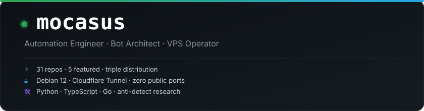

  

  
  
  
  

 

  
  
  
  
  
  

  

 

  
  

  
  

 

  

  

 

<b>About</b>

 

**EN** — Building automation infrastructure since 2023. Operating 50+ open-source repos across Telegram bots, Discord systems, headless browser automation, and full-stack web apps. Self-hosted on Debian 12 + Docker + Cloudflare Tunnel. Active research in browser fingerprinting and captcha analysis.

**ID** — Membangun infrastruktur otomasi sejak 2023. 50+ repositori open-source — Telegram bot, Discord, otomasi browser, web app. Self-hosted di Debian 12 + Docker + Cloudflare Tunnel. Riset aktif fingerprinting browser & analisis captcha.

 

  v7.2 · 2026-07-15

